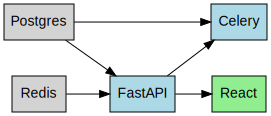

Usage Examples
==============

The following example demonstrates the core features of ``graphable``, including building a graph, performing topological sorts, and generating various visualizations.

Basic Usage
-----------

This script (available in the repository as ``examples/basic_usage.py``) shows how to:
- Define nodes and relationships.
- Use tags for organization and styling.
- Generate text-based and graphical representations.

.. code-block:: bash

   uv run examples/basic_usage.py --mermaid-svg --graphviz-svg --output-dir docs/_static/examples > docs/_static/examples/basic_usage_output.txt

.. literalinclude:: ../examples/basic_usage.py
   :language: python
   :linenos:
   :caption: examples/basic_usage.py

Output
------

Running the script produces the following text output:

.. literalinclude:: _static/examples/basic_usage_output.txt
   :language: text
   :caption: Execution Output

Visualizations
--------------

The script also generates visual representations of the graph.

Mermaid SVG
^^^^^^^^^^^

The Mermaid visualization shows the flow and relationships:

Graphviz SVG
^^^^^^^^^^^^

The Graphviz visualization (with custom styling) provides a different perspective:

D2 SVG
^^^^^^

The modern D2 visualization with automatic layout:

.. image:: _static/examples/topology_d2.svg
   :alt: D2 Topology Diagram
   :align: center

PlantUML SVG
^^^^^^^^^^^^

The enterprise-standard PlantUML visualization:

.. image:: _static/examples/topology_plantuml.svg
   :alt: PlantUML Topology Diagram
   :align: center

Graphviz Styling
^^^^^^^^^^^^^^^^

The Graphviz view supports extensive customization through the ``GraphvizStylingConfig`` class. You can customize node labels, attributes, and global graph settings.

.. code-block:: python

   from graphable.views.graphviz import GraphvizStylingConfig, create_topology_graphviz_dot

   gv_config = GraphvizStylingConfig(
       graph_attr={"rankdir": "LR", "nodesep": "0.5"},
       node_attr_default={"shape": "rounded", "style": "filled", "fontname": "Arial"},
       node_attr_fnc=lambda n: {
           "fillcolor": "lightblue" if "backend" in n.tags else "lightgreen"
       },
   )
   dot = create_topology_graphviz_dot(graph, gv_config)

Key configuration options include:

*   ``graph_attr``: Global attributes for the graph (e.g., ``rankdir``, ``label``).
*   ``node_attr_default``: Default attributes applied to all nodes.
*   ``edge_attr_default``: Default attributes applied to all edges.
*   ``node_attr_fnc``: A function that takes a ``Graphable[Any]`` and returns a dictionary of attributes for that specific node.
*   ``edge_attr_fnc``: A function that takes two ``Graphable[Any]`` nodes (source and target) and returns attributes for the edge between them.
*   ``node_label_fnc``: Customize how labels are generated for each node.

Cycle Detection
---------------

When building a graph, especially when relationships are defined dynamically or based on user input, it's important to avoid circular dependencies. ``graphable`` provides a mechanism to check for cycles whenever you add a relationship.

You can enable cycle detection by passing ``check_cycles=True`` to any of the dependency management methods on a ``Graphable`` node:

.. code-block:: python

   from graphable.graphable import Graphable
   from graphable.errors import GraphCycleError

   a = Graphable("A")
   b = Graphable("B")
   c = Graphable("C")

   a.add_dependency(b)
   b.add_dependency(c)

   try:
       # This would create a cycle: C -> B -> A -> C
       c.add_dependency(a, check_cycles=True)
   except GraphCycleError as e:
       print(f"Cycle detected! Path: {[n.reference for n in e.cycle]}")

This check is performed using a Breadth-First Search (BFS) to find if a path already exists in the direction that would complete a loop.

The following methods support the ``check_cycles`` parameter:

*   ``add_dependency(dependency, check_cycles=False)``
*   ``add_dependencies(dependencies, check_cycles=False)``
*   ``add_dependent(dependent, check_cycles=False)``
*   ``add_dependents(dependents, check_cycles=False)``
*   ``requires(dependency, check_cycles=False)``
*   ``provides_to(dependent, check_cycles=False)``

In addition, the ``Graph.add_edge`` and ``Graph.add_node`` methods always perform cycle detection to ensure the integrity of the graph.

Transitive Reduction
--------------------

For complex graphs, redundant edges can clutter the visualization. Transitive reduction removes these edges while preserving the reachability of the graph.

.. code-block:: python

   # Returns a new Graph instance with redundant edges removed
   reduced_g = graph.transitive_reduction()

   # Or render directly using the convenience method
   from graphable.views.mermaid import create_topology_mermaid_mmd
   print(graph.render(create_topology_mermaid_mmd, transitive_reduction=True))

Clustering by Tags
------------------

You can group nodes into clusters in visualizations like Mermaid, Graphviz, D2, and PlantUML based on their tags.

.. code-block:: python

   from graphable.views.mermaid import MermaidStylingConfig, create_topology_mermaid_mmd

   # Enable clustering in the configuration
   config = MermaidStylingConfig(cluster_by_tag=True)

   # Render the graph with clusters
   print(graph.render(create_topology_mermaid_mmd, config=config))

Nodes are grouped by their first tag (by default, tags are sorted alphabetically). You can provide a custom ``tag_sort_fnc`` in the configuration to control which tag is used for grouping.

Parsing Graphs
--------------

``graphable`` can reconstruct graphs from all major export formats. This is useful for terminal-based tools or for persisting graph structures between sessions.

.. code-block:: python

   from graphable.graph import Graph

   # Load from JSON file
   g_json = Graph.from_json("topology.json")

   # Load from YAML string
   yaml_content = "nodes: [{id: A}, {id: B}], edges: [{source: A, target: B}]"
   g_yaml = Graph.from_yaml(yaml_content)

   # Load from CSV edge list
   g_csv = Graph.from_csv("edges.csv")

The following static methods are available on the ``Graph`` class:

*   ``from_json(source, reference_type=str)``
*   ``from_yaml(source, reference_type=str)``
*   ``from_toml(source, reference_type=str)``
*   ``from_csv(source, reference_type=str)``
*   ``from_graphml(source, reference_type=str)``

Equality Comparison
-------------------

Graphs can be compared for equality using the standard ``==`` operator or the ``is_equal_to()`` method. Two graphs are considered equal if they have:
1. The same number of nodes.
2. Nodes with matching references and tags.
3. The same directed edges between those nodes.

.. code-block:: python

   g1 = Graph.from_json("graph.json")
   g2 = Graph.from_yaml("graph.yaml")

   if g1 == g2:
       print("The graphs are identical.")

Subgraph Semantics & Syncing
----------------------------

A ``Graph`` instance acts as a "view" of a specific set of nodes. Even if a node in the graph is connected to "external" nodes that are not members of the graph, operations like topological sorts and checksums will only respect and include nodes that are explicitly part of the ``Graph`` instance.

**Filtering Behavior**

*   **Topological Order**: Methods like ``topological_order()`` and ``parallelized_topological_order()`` will filter out any nodes not present in the graph's membership.
*   **Checksums**: The ``checksum()`` method only accounts for nodes in the graph and edges between those specific nodes.

**Syncing with Discover**

If you want to expand a ``Graph`` to include all reachable ancestors and descendants of its current nodes, you can use the ``discover()`` method. This effectively "syncs" the graph with the full connected structure of its members.

.. code-block:: python

   # G only contains node 'A' initially
   g = Graph({a})

   # A depends on B, B depends on C
   # After discover(), G will contain A, B, and C
   g.discover()

Node Ordering
-------------

``Graphable`` nodes support rich comparison operators based on their reachability in the graph:
- ``a < b``: ``a`` is a proper ancestor of ``b``.
- ``a <= b``: ``a`` is an ancestor of or identical to ``b``.
- ``a > b``: ``a`` is a proper descendant of ``b``.
- ``a >= b``: ``a`` is a descendant of or identical to ``b``.

This provides a clean way to check for dependency relationships directly between node objects.

.. code-block:: python

   if node_a < node_b:
       print("node_a must come before node_b")

Caching & Performance
---------------------

The ``Graph`` class implements an efficient observer-based caching system for expensive operations:
*   ``topological_order()``
*   ``parallelized_topological_order()``
*   ``checksum()``

Calculations are performed once and cached. If any node in the graph is modified (tags changed, dependencies added/removed), the graph is automatically notified and invalidates its cache. This ensures high performance for repeated access while maintaining absolute correctness.

Unified I/O
-----------

``graphable`` provides high-level ``read()`` and ``write()`` methods that automatically detect the file format based on the extension. This is the simplest way to work with graph files.

.. code-block:: python

   # Reading
   g = Graph.read("topology.json")

   # Writing (supports all formats including graphical)
   g.write("topology.svg")
   g.write("topology.yaml")

   # Supports transitive reduction during write
   g.write("simple.mmd", transitive_reduction=True)

Integrity & Checksums
---------------------

To ensure your graph structure and metadata (tags) haven't changed, you can use the deterministic BLAKE2b checksum feature.

.. code-block:: python

   # Calculate hex digest
   digest = g.checksum()

   # Validate later
   if g.validate_checksum(digest):
       print("Integrity verified!")

The checksum is stable across different Python sessions and is independent of node creation order.

Parallel Processing
-------------------

For task orchestration, you often need to know which nodes can be processed simultaneously. The ``parallelized_topological_order()`` method groups nodes into independent "layers."

.. code-block:: python

   for i, layer in enumerate(g.parallelized_topological_order()):
       print(f"Layer {i} (can run in parallel): {[n.reference for n in layer]}")

Like the standard topological sort, this also supports ``_filtered`` and ``_tagged`` variants.

Command Line Interface
----------------------

``graphable`` includes a command-line tool for managing graph files without writing Python code. It is available as the ``graphable`` command after installation.

**Installation**

To get the full experience with formatted tables and panels, install the ``cli`` extra:

.. code-block:: bash

   pipx install "graphable[cli]"

**Subcommands**

*   **``info <file>``**: Displays summary statistics about the graph, including node count, edge count, and identified source/sink nodes.
*   **``check <file>``**: Performs validation on the graph. It checks for circular dependencies and bidirectional consistency.
*   **``convert <input> <output>``**: Converts a graph from one format to another. The format is automatically detected from the file extension.
*   **``reduce <input> <output>``**: Reads a graph, computes its transitive reduction (removing redundant edges), and saves the simplified version to the output file.

**CI/CD and Automation**

If you are using ``graphable`` in a script or CI/CD pipeline and want to ensure plain-text output regardless of installed dependencies, use the ``--bare`` flag before the subcommand:

.. code-block:: bash

   graphable --bare info topology.json

**Supported Extensions**

- **Input**: ``.json``, ``.yaml``, ``.yml``, ``.toml``, ``.csv``, ``.graphml``
- **Output**: All input formats plus ``.dot``, ``.gv``, ``.mmd``, ``.d2``, ``.puml``, ``.html``, ``.tex``, ``.txt``, ``.ascii``, ``.svg``

ASCII Flowchart
---------------

For a quick, boxed representation of the graph that handles multiple parents better than a standard tree, use the ``asciiflow`` view:

.. code-block:: python

   from graphable.views.asciiflow import create_topology_ascii_flow

   print(create_topology_ascii_flow(g))

This is ideal for terminal-based tools or quick debugging where you need to see the full directed structure without leaving the command line.

Scientific Publishing (TikZ)
----------------------------

If you are writing a LaTeX paper or report, you can export your graph directly to TikZ code:

.. code-block:: python

   from graphable.views.tikz import create_topology_tikz, TikzStylingConfig

   # Generates a \begin{tikzpicture} block
   tikz_code = create_topology_tikz(g)

It supports the modern TikZ ``graphs`` library by default, ensuring high-quality vector output that matches your document's font and style perfectly.

Data Export & Interoperability
------------------------------

``graphable`` makes it easy to move your graph data into other tools for analysis or custom visualization.

**JSON, YAML & TOML**

Export to standard machine-readable formats:

.. code-block:: python

   from graphable.views.json import create_topology_json
   from graphable.views.yaml import create_topology_yaml
   from graphable.views.toml import create_topology_toml

   json_data = create_topology_json(g)
   yaml_data = create_topology_yaml(g)
   toml_data = create_topology_toml(g)

**Cytoscape**

Generate a standalone, interactive HTML file that you can share with anyone. It uses Cytoscape.js for rendering and supports zooming, panning, and dragging:

.. code-block:: python

   from graphable.views.html import export_topology_html

   export_topology_html(g, "interactive_graph.html")

You can view a live demonstration here: :raw-html:`<a href="_static/examples/topology_interactive.html" target="_blank">topology_interactive.html</a>`

**GraphML**

For professional graph analysis in tools like Gephi or yEd, export your graph to the GraphML XML standard:

.. code-block:: python

   from graphable.views.graphml import export_topology_graphml

   export_topology_graphml(g, "graph_data.graphml")

**CSV Edge List**

For processing in Excel, Pandas, or other data tools:

.. code-block:: python

   from graphable.views.csv import create_topology_csv

   # Generates "source,target" rows
   csv_data = create_topology_csv(g)

NetworkX Integration
--------------------

For users who need advanced graph analysis capabilities, ``graphable`` provides seamless integration with the `NetworkX <https://networkx.org/>`_ library.

If you have ``networkx`` installed, you can convert any ``graphable.Graph`` to a ``networkx.DiGraph`` using the ``to_networkx()`` method:

.. code-block:: python

   import networkx as nx
   from graphable.graph import Graph
   from graphable.graphable import Graphable

   g = Graph()
   # ... build your graph ...

   # Convert to NetworkX
   dg = g.to_networkx()

   # Use any NetworkX algorithm
   longest_path = nx.dag_longest_path(dg)
   print(f"Longest path: {longest_path}")

The conversion preserves node references and tags as node attributes, allowing you to access your original data within NetworkX algorithms.
